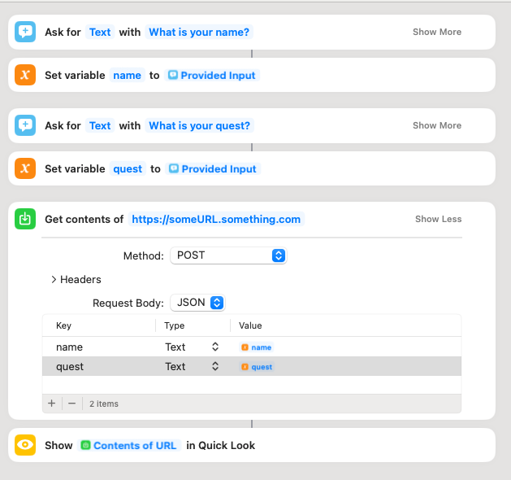

# Apple Shortcuts
"Shortcuts" is a low-code scripting application available on most Apple platforms.  
Apple acquired the independent iOS App "Workflow" in 2017 and re-introduced it as "Shortcuts" in 2018.  In 2021, the macOS version was introduced. 

Though macOS has had "Automator" since 2005, it runs only on macOS.  With Shortcuts available across the various OS platforms, this gives a unified tool for Automation. 

Automations can be manually started from the Shortcuts App, via Widgets, and by Siri.  On macOS, you can also have these scheduled to run on a regular basis (such as via crontab or launchctl). 

Among the many different options available in Shortcuts, there is the _Get Contents of URL_ action.  Not only can get this get data from a URL as the name implies, it also allows one to POST data, including in JSON format.  For those that are familiar with Power Automate, this is very similar to the _Send an HTTP Request_ actions available in many connectors.  Shortcuts also have the option to request information as part of its flow and this data can also be passed along in any submission.  With all these different features, it opens up more possibilities of "hooking" Macs and iPhones into the SKY API ecosystem. 

*Note*: With the introduction of Widgits and Power Automate Desktop into Windows, similar options may be available there.  However, this will focus specifically on Apple's OSes. 

## Approach
As of writing, Shortcuts does not yet natively handle Oauth 2, the key technology powering Blackbaud ID (BBID).   Though there are published workarounds to this, for the purposes of security, the discussed approaches will not include those. 

The initial example(s) focus on using Shortcuts to kick-off on-demand processes directly from macOS, iOS, iPadOS etc without having to log into the SKY API enabled solution directly.  To keep things low-code, this will be paired with Power Automate. 

