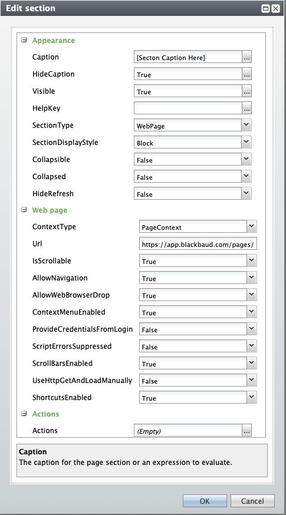

# SKY Page Add-ins

<!-- vscode-markdown-toc -->
* [Background](#Background)
	* [Setting Up a Page SKY Add-in](#SettingUpaPageSKYAdd-in)
* [BBCRM Bonus Feature: Embedded Page SKY Add-ins](#BBCRMBonusFeatureEmbeddedPageSKYAdd-ins)
	* [The Benefit](#TheBenefit)
	* [To embed a Page Add-in into BBCRM](#ToembedaPageAdd-inintoBBCRM)

<!-- vscode-markdown-toc-config
	numbering=false
	autoSave=false
	/vscode-markdown-toc-config -->
<!-- /vscode-markdown-toc -->

## <a name='Background'></a>Background
[SKY Add-ins](https://developer.blackbaud.com/skyapi/docs/addins) have previously been associated with the likes of Raiser's Edge NXT and Financial Edge NXT.  

However, Altru customers and BBCRM customers _who are in Blackbaud Cloud Operations with BBID enabled_ can utilize [Page add-ins](https://developer.blackbaud.com/skyapi/docs/addins/get-started/page-addins). 

Page Add-ins, like the other SKY Add-ins, do not require any SDK specific knowledge.  Developers can use familiar web development technologies such as HTML, CSS, and JavaScript to augment the solution with new functionality.

In a nutshell, Page add-ins are independent full pages that technically live outside the host application. They are technically connected to the environment. In the case in which someone accesses a link to that Page add-in, they still have to first authenticate through the host environment if they haven't already done so. They are connected to the host environment via a Developer App, similar to other common add-in types. The "frame" of the page runs on Blackbaud servers, though the content is powered externally and can use both Blackbaud-based and non-Blackbaud-based data.  Unlike items such as tile add-ins, they do _not_ get any contextual information such as recordId automatically. When one creates a link to that page, they can include as a URL parameter key information that the add-in will need, such as recordId.  

Page add-ins utilize SKY UX which means they can include the likes of their own fly-outs, modals, etc.  They can also utilize the same low-code options available such as Power Apps and Adaptive Cards. 

If you're new to working with SKY Applications, etc, you can find a getting started at https://developer.blackbaud.com/skyapi/docs/getting-started . 

### <a name='SettingUpaPageSKYAdd-in'></a>Setting Up a SKY Page Add-in
Page Add-ins are established under the Add-in area of a SKY Developer App by Giving it a name, the Add-in URL (the external source that's actually powering the content/features), and select _Navigation_ => _Page_ under the Extension Point. 


Want to kick the tires a bit on what's available via a SKY Page Add-in?  Create an app and add `https://glenhutson.github.io/BlackbaudCustomizations/SKYAddinHelloWorld/helloworldpage.html` as a Page add-in.  This sample page contains many of the elements available to SKY Page add-ins. 

The resulting direct link for the Page add-in is

```
https://app.blackbaud.com/pages/applications/SKYAPPID/pages/PAGENAME?envid=ENVID&svcid=SVCID
```
Where: 
* "SKYAPPID" = The Application ID listed at the top of your App's configuration Page. 
* "ENVID" =  Your Environment ID
* "PAGENAME" = The name you gave to the Add-in with "%20" Replacing any spaces
* "SVCID" = the solution you're connecting to.

The svcid for Blackbaud CRM is _ecrm_ whereas the svcid for Altru is _altru_. 

If you want to include some context, such as a recordId, you'd add `&context_recordId=` to the end.  Example resulting URL will look like: 

```
https://app.blackbaud.com/pages/applications/4d540b94-1854-45fa-b1d6-c2039d94b681/pages/PAGENAME?envid=p-12345678&svcid=ecrm&context_recordId=f9ca8058-4956-9b99-aa5e-e1bd4f5b99cc 

```
In the example URL above, the recordId in this case may be an Individual.  As the page is loaded, it can use that recordId + SKY API to retrieve information about that individual and display it. 

## <a name='BBCRMBonusFeatureEmbeddedPageSKYAdd-ins'></a>BBCRM Bonus Feature: Embedded Page SKY Add-ins
BBCRM Customers can use native Page Designer functions to embed the SKY Page add-ins directly into the BBCRM shell.  SKY Page add-ins are mobile responsive by nature, so they can also be added as a tab on record pages.  This hybrid approach allows one to take advantage of many of the SKY Add-in features in the native BBCRM framework. In some cases, using the [Power BI Host SPA ](https://docs.blackbaud.com/microsoft-connectors-docs/microsoft-power-platform/power-bi/power-bi-addins) on a Page Add-In embedded on a BBCRM page may cause better results in working with those reports. 

> Note this is only applicable to BBCRM instances in Blackbaud Cloud Operations with BBID enabled and does not apply to Altru customers. 

### <a name='TheBenefit'></a>The Benefit
This  approach enables the potential delegation of building customizations to developers who may not be familiar with the SDK.  As SKY Add-ins have a number of built in hooks for the Power Platform, this means even low-coders / Business Analysts / etc can address some customization and automation needs.  This can help free up time for the pro-coders to focus on those elements that do require SDK knowledge.  Since in many cases access to even the Page Designer isn't needed until final deployment, the development lifecycle can also be shorter. 

> Heads up: though this embedding method can help approximate many use cases of SKY Add-ins within BBCRM, it's still an embedded page.  This means any fly-outs, modals, etc will be bound within the context of the embedded piece.  For example, fly-outs triggered from a tab will only fly-out within the tab, not the full BBCRM page.  If using any of our pre-configured Host SPAs, you will always be configuring it as if it was a tile.  

### <a name='ToembedaPageAdd-inintoBBCRM'></a>How to embed a Page Add-in into BBCRM

Once you've created your Page Add-in, you can embed it into a page/tab/section similar to embedding any other web page: 

1. Go to the page where you wish to embed the Add-In (existing or newly created) and activate Page Designer. 
2. Click On _Edit Tabs_
3. Click on _Add_ (or edit an existing)
4. Give it a caption, and set to visible.
5. Click "..." next to _Sections_
6. Add or edit an existing section with the following settings: 
   * SectionType = Web Page
   * SectionDisplayStyle = Block
   * Collapsible = False (usually)
   * Collapsed = False
   * HideRefresh = False
   * Context Type = PageContext (only if you need to pass it the likes of the recordId)
   * URL:
     * The URL will be constructed as per [Setting Up a Page SKY Add-in](#SettingUpaPageSKYAdd-in). However, you will _add_ the URL parameter `&addin=1`.  If this is going to be embedded on a record page and you wish to pass it the record ID, you will need to make sure `&context_recordId=@@PAGECONTEXTRECORDID@@` is at the end. This will give it a structure similar to: 

     ``` 
     https://app.blackbaud.com/pages/applications/SKYAPPID/pages/PAGENAME?envid=ENVID&svcid=ecrm&addin=1&context_recordId=@@PAGECONTEXTRECORDID@@ 
     ```
    * IsScrollable = True
    * AllowNavigation = True
    * AllowWebBrowserDrop = True
    * ContextMenuEnabled = True
    * See Also https://kb.blackbaud.com/knowledgebase/articles/Article/107347 

7. Click / OK / Save until you are back to the BBCRM page.  



