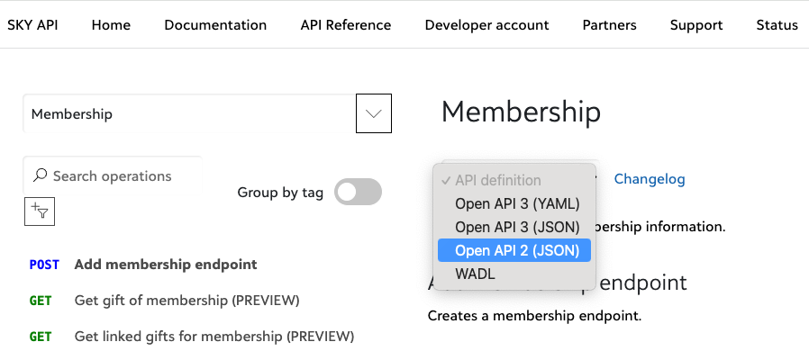
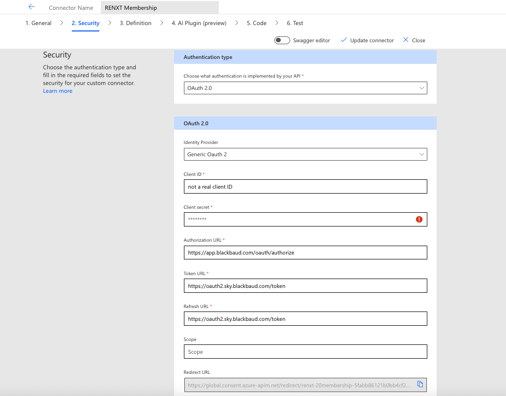
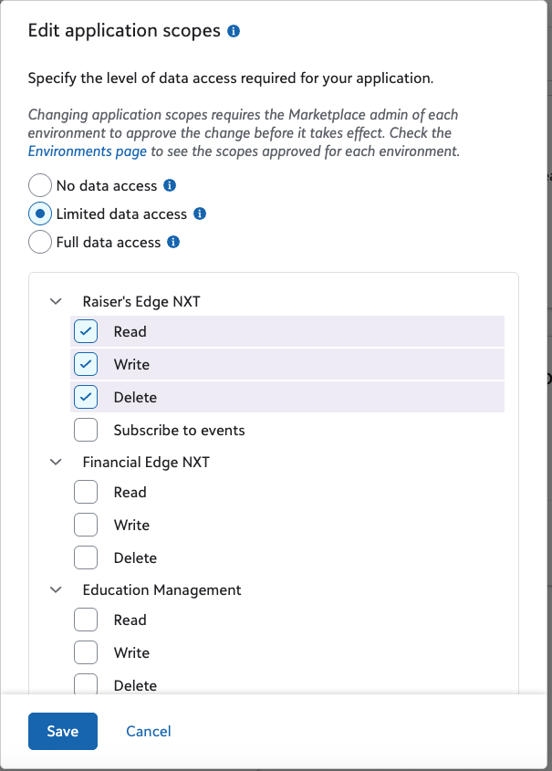

# Blackbaud Raiser's Edge NXT® Membership Custom Connector for Microsoft Power Platform

The instructions here provide an example of how to create a SKY API based Custom Connector for the Power Platform, using Raiser's Edge NXT Membership as the subject.  

(The instructions are adapted from those provided by [npAutomate](https://npautomate.com/) for a similar exercise for Blackbaud Financial Edge NXT). 

## Warning
> At the time of this writing, several pieces of the Membership API in Raiser's Edge NXT are still under development and/or in PREVIEW. Keep an eye on the [changelog](https://developer.blackbaud.com/skyapi/support/changelog/renxt) for any updates that may require updating the connector.  It is recommended that you don't use any endpoints marked as PREVIEW in production scenarios. 

## Where to go for help
Please direct any questions to the [Blackbaud / Microsoft Power Platform Forum](https://community.blackbaud.com/forums/viewcategory/586). Any direct messages on GitHub, the Community, or other means will be pointed back to the forum.  _These are not covered by Blackbaud Support_. 

## Disclaimer
THE SOFTWARE IS PROVIDED "AS IS", WITHOUT WARRANTY OF ANY KIND, EXPRESS OR IMPLIED, INCLUDING BUT NOT LIMITED TO THE WARRANTIES OF MERCHANTABILITY, FITNESS FOR A PARTICULAR PURPOSE AND NONINFRINGEMENT. IN NO EVENT SHALL THE AUTHORS OR COPYRIGHT HOLDERS BE LIABLE FOR ANY CLAIM, DAMAGES OR OTHER LIABILITY, WHETHER IN AN ACTION OF CONTRACT, TORT OR OTHERWISE, ARISING FROM, OUT OF OR IN CONNECTION WITH THE SOFTWARE OR THE USE OR OTHER DEALINGS IN THE SOFTWARE.

## Prerequisites

1. Confirm access to Blackbaud Raiser's Edge NXT® solution.
2. You will need the ability to connect applications from the [Blackbaud Marketplace Manage](https://app.blackbaud.com/marketplace/manage) page. For permissions needed to link an app to an environment, see
https://community.blackbaud.com/blogs/69/9456 . 
3. Since this is a custom connector, you will need to create an app for this (it won't be connecting through the standard Power Platform App).  
4. Confirm login access to Microsoft Power Automate. 
      - A version of Microsoft (Office) 365 that includes Microsoft Power Platform is required.
      - This Custom Connector will be accessible through Power Automate and Power Apps.
      - Go to [Microsoft Power Automate](https://make.powerautomate.com) and confirm the ability to login.

## Create a new application with Blackbaud SKY Developer Portal

1. If you do not already have one, sign up for a [Blackbaud SKY Developer account](https://developer.blackbaud.com/signup). This account represents you as a "developer" within the Blackbaud Developer Portal and enables you to create applications. If you don't already have a Blackbaud ID, it will also prompt you to create one. 
If you do have one, sign in to your Blackbaud account.
2. Go to Blackbaud SKY Developer [My applications page](https://developer.blackbaud.com/apps/) and select **Add**.
3. Fill out the Add application screen. We recommend you name it something that helps you identify it as your custom connector.
4. Once saved, take note of the **application ID** and **application secret**.  Those are needed when you create the custom connector. KEEP THIS OPEN in another tab, you'll need it later. You can get back to these values at any time by going to the Blackbaud SKY Developer [My applications page](https://developer.blackbaud.com/apps/) and opening the application you created.    

## Configure the Custom connector

1. Head to the [Raiser's Edge NXT Membership SKY API Documentation](https://developer.sky.blackbaud.com/api#api=membership).
2. From the API Definition drop-down at the top, make sure you select _Open API 2 (JSON)_.  As of writing, Power Automate is **not** compatible with Open API 3. 

3. Save that to your computer. 

4. Log in to [Microsoft Power Automate](https://make.powerautomate.com).
5. On the left menu, select **Custom connectors** (you may have to select "More" first). 
4. Select **New Custom Connector** from the top-right, and then **Import an OpenAPI file**.
6. Assign a connector name, such as "Raiser's Edge NXT Membership (Custom)."
7. Select **Import** and choose the file you just downloaded and then select **Open**.
8. Go to the **Security** tab.  Ensure OAuth 2.0 is selected. This may already have reference to "API Key", we're going to overwrite that.   Enter the client ID (Application ID) and client secret (application secret) from the [Blackbaud Developer app](https://developer.blackbaud.com/apps/) that was created.
9. Set the Authorization URL to https://app.blackbaud.com/oauth/authorize and the Token & Refresh URLs to https://oauth2.sky.blackbaud.com/token .  

10. At the top, select **Create connector**. 
11. Scroll all the way to the bottom and click the copy icon (two pieces of paper laying on top of each other) next to the "Redirect URL".  Save this for later.  

12. Go to the **Definition** page.

13. On the Definition page, first define a **Policy** (may have to scroll all the way down) to allow for Oauth 2 authentication to a specific  environment.  Scroll down and select **New Policy**.

      1. **Name**:  Enter "Bb-Api-Subscription-Key"
      2. **Template**:  Set HTTP Header
      3. **Operations**:  Leave blank
      4. **Header name**:  `Bb-Api-Subscription-Key`
      5. **Header Value**:  Enter the primary access key or secondary access key defined from the Blackbaud SKY Developer Portal [My subscriptions]( https://developer.blackbaud.com/subscriptions/). If you don't have a subscription, subscribe to the **Standard APIs**.
      6. **Action if header exists**:  override
      7. **Run policy on**:  Request  
      

14. Select **Update Connector**.

15. Go Back to the SKY Developer APP you created previously. 
16. Under **Redirect URI**, paste in the URL you copied from the "Redirect URL on the Custom Connector Security Page".  
17.  Under Scopes, check at least Limited with Read, Write, and Delete Under Raiser's Edge NXT. 

18. >IF YOU HAVE access to the SKY Developer Cohort Environment (see https://docs.blackbaud.com/microsoft-connectors-docs/microsoft-power-platform/getting-started and scroll all the way down), you will not need to manually add this to that environment, it will be added there automatically.  If you need to connect it to one of your own environments:
19. Go to the [Blackbaud Marketplace Manage](https://app.blackbaud.com/marketplace/manage) page.
20. Select **Connect app**. Paste in your **application ID** from your SKY APP. 

