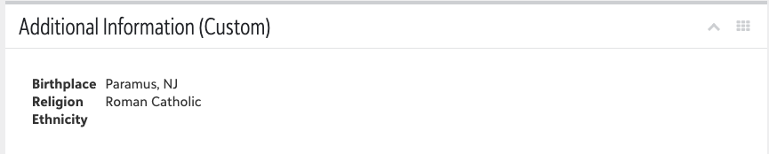
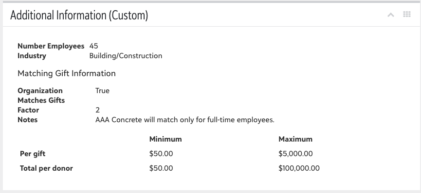

# Constituent Additional Information (AKA "BioOrg2")
## Background
Typically speaking, information available in SKY API is also available in the WebView.  However, that's not always the case.  This Adaptive Card based flow shows an example of surfacing information that is "API-only" as a custom tile.  

It is originally inspired by the information that's available in either the Individual Bio 2 tab or the Organization Org 2 tab in Database View, hence the name.   However, for Orgs, it does include Matching Gift information that's on the Org 1 tab.  

It does not contain all the pieces of information that's available on those tabs either due to that information not being available in the API (at the time of publication) or already available elsewhere in the system. 

This one flow handles both Individual and Organizations by branching depending on type of Constituent.  

## Examples
Individual / Bio 2 

 

Organization / Org 2 + Matching Gift

## Installation

See the [Tile SKY Add-Ins readme](../../All-In-One-SKYAddins+PowerAutomate/TileSKYAddins.md) for information on installation.  

