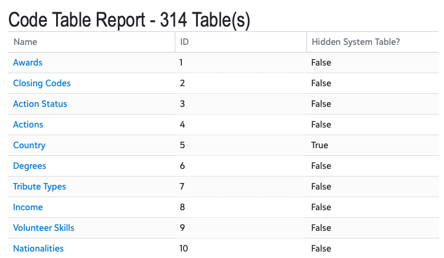
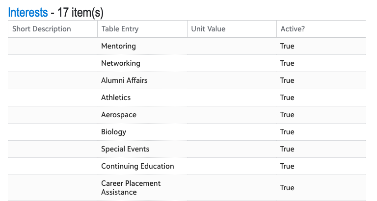

# RENXT Code Tables Report

There are TWO versions of this flow. 

1. **Scheduled:** This "stand-alone flow" generates a regularly scheduled email report inspired by the Code Tables Report in Raiser's Edge NXT Database View (Tables -> File -> Print / Preview -> Code Tables Report).  Email was selected as the initial method of delivery due to the time it takes to generate may not be conducive to an in-product (Tile/Page Add-in) option. 
2. **OnDemand:** Similar to the above version, but is triggered by a link on the Raiser's Edge NXT Home Screen (SKY Add-in).  This is setup to be sent to the person who triggered it. This link  **would be visible to everyone** who has access to Raiser's Edge NXT, _even if they're in a security group that doesn't have rights to Code Tables_.  See the On Demand section below for a permissions check built-in. 

The emailed report starts of with a table of contents of all tables linked to a section of the report that shows each of the table entries.  The heading of each section includes a link directly to the corresponding table in Raiser's Edge NXT.  

## Installation

See [Importing Flows](https://docs.blackbaud.com/microsoft-connectors-docs/microsoft-power-platform/basics/import-flows) on instructions on how to import flows.  

See the [Raiser's Edge NXT Readme](../README.md) for links discussing the various aspects of Add-ins, disclaimer, and how to get help. 

### Flow-specific installation instructions - Scheduled Version
This only needs two key pieces of information to get setup: 
* Email address of the recipient of the report
* Environment ID of your Raiser's Edge NXT instance (the part after "envid=" in the address bar). 

When editing the flow:
1. Adjust the scheduling as desired
2. Open the _README - ACTION REQUIRED_ step, review, and follow those instructions. 
3. Open the _Initialize variable - EnvironmentID_ step and update that with your Environment ID. 
4. Open the _Initialize variable - ReportEmail_ and update with the email address to which the report should be delivered.  
5. In many cases, flows are imported turned off, _make sure you turn it on_ for it to function. 
6. This uses the generic _Send an email notification_ action to send the email.  You may want to consider replacing this with the Outlook or Gmail option. 

### Flow-specific installation instructions - On Demand Version

#### Creating an Application
This version of the flow requires you to register this as an Add-in to a SKY Developer Application.  See https://docs.blackbaud.com/microsoft-connectors-docs/microsoft-power-platform/power-automate/invoke-a-flow for additional details of the "Invoke a Flow" process.  

**NOTE**: INSTEAD of selecting the "Constituent Page Action" for the Extension Point, Choose `Development Office -> Home Page -> Development Office Home Action`

You will also need one additional piece of information to get setup: 
* Email addresses of those authorized to run the report.  Since this link is available to _everyone_ who has access to Raiser's Edge NXT, regardless of security settings, an extra check is built into the flow. 

When editing the flow:
1. You will need to copy the "HTTP POST URL" link under the _When a HTTP request is received_ action at the top. This will need to be "url encoded" to work.  Googling "url encode" provides a number of online services for this. 
2. Open the _Validate a user identity token_ action and replace the "Application ID" with the one created for the SKY Add-In (see the "Creating an Application" Section above)
3. Open the _README - ACTION REQUIRED_ step, review, and follow those instructions. 
4. Open the _Initialize variable - AuthorizedUsers_ and update with the email addresses (those tied to the Blackbaud ID Logins) authorized to run the report.  Leaving it blank will mean everyone with access to Raiser's Edge NXT will be able to run it. 
5. In many cases, flows are imported turned off, _make sure you turn it on_ for it to function. 
6. This uses the generic _Send an email notification_ action to send the email.  You may want to consider replacing this with the Outlook or Gmail option. 

### Flow-specific considerations
1. This uses the slightly more manual _Send an HTTP Request_ action.  Any optional filtering will need to be done via the "Query parameters" area.  See [GetCodeTableList](https://developer.sky.blackbaud.com/docs/services/nxt-data-integration/operations/GetCodeTableList) and [GetTableEntriesList](https://developer.sky.blackbaud.com/docs/services/nxt-data-integration/operations/GetTableEntriesList) for available options. 
2. By default, this shows both "hidden system tables" and inactive table entries.  To remove these from the report, edit the corresponding _Send an HTTP request_ actions and change the query parameters from "true" to "false". 
3. This uses the "NXT Data Integrations" set of endpoints.  At time of writing, **this API currently requires that the consenting user (the credentials you use to connect the _Send an HTTP Request_ ) be an environment administrator.**
4. This will show tables with 0 entries.  

