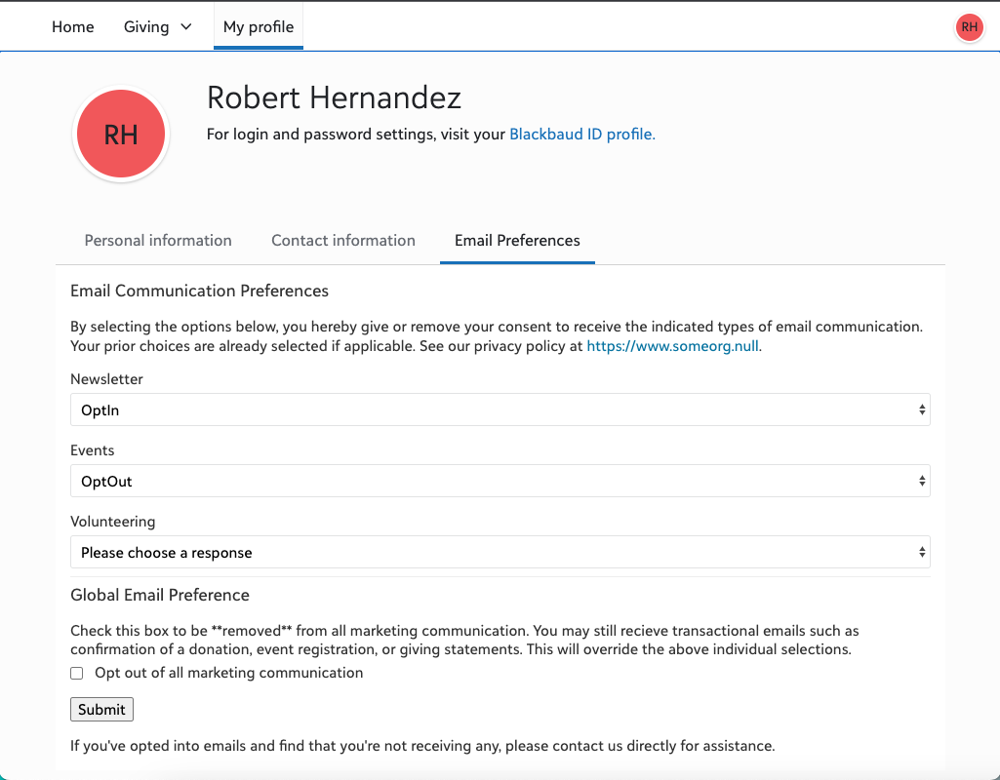

# RENXT Portal Email Preferences



This has two flows: 
1. Presents a portal _logged in_ user select Email Channel Consent Categories with their current elections (if applicable) and allows the Constituent to make changes.  This also incudes the "total opt out" that maps to the "Requests no email" checkbox on their record.  The form is via an Adaptive Card.
2. Process the submissions and creates an Action on the Constituent record further documenting the changes for historical references.  Though Consent does maintain historical data, the "Requests no email" does not, so this will help fill in those pieces. 

## _NOTE_  - About this Approach
It is recognized that there are a range of approaches in how organizations track communication preferences, interests, etc.  This example addresses one scenario.  It's encouraged that you review this thoroughly to verify it fits yours and make any adjustments needed.  If this doesn't fit your approach, you may be able to get some ideas on how to build a solution that does fit. 

## Pre-Requisites - RENXT
1. Setup of Consent Categories in Control Panel -> Tables (Webview) or Configuration -> Tables (Database View)
2. Setup of Mapping between Channel (Email) and Categories as well as related Solicit Codes.  As of this writing, still done in Database View in Configuration -> Business Rules.
3. Create a new Consent Source in Control Panel -> Tables (Webview) or Configuration -> Tables (Database View) to track those changes that came through this process.  The default setup in the flow is "Portal (Power)".  

## Installation
See the [Raiser's Edge NXT Readme](../README.md) for links discussing the various aspects of Add-ins, disclaimer, and how to get help. 

### Flow-specific installation instructions
* With the release of new options for the RENXT Portal, may want to consider creating a separate application in the Developer Portal for those for organizing purposes.  However, feel free to continue using any pre-existing Application you've created. 

1. Import the "Submission" flow first. 
   * Update the _Validate a user identity token_ with the Application ID to which you will be connecting this. 
   * Scroll all the way to the bottom and under _Create a constituent action_ update the "Type" to one you wish to use for recording the interaction. 
   * (Optional) Consider creating a step that will send an email to the Constituent with the details of their selections.  It is recommended to _not_ use the generic "Send an email notification" as that will mention Power Automate, and customers will not know what that is.  Instead, use the Outlook or Gmail version so that it will look like it's coming from your organization. 
   * (Optional) This flow uses the connector-specific _Create a constituent consent record_.  Could consider replacing that with the slightly more manual _Send a HTTP request_  from the SKY Add-ins connector with which you can change the "author" of the consent entry to someone other than the user that authenticates the connection.  _May_ also allow you to submit more than one Consent entry at once. 
   * Save the Flow
   * Scroll all the way back to the top and copy the URL that's listed in the _When a HTTP request is received_ trigger. 

2. Import the "Form" flow. 
   * Update the _Validate a user identity token_ with the Application ID to which you will be connecting this. 
   * Make sure to review and take action on any "README"s listed in the flow. 
   * Open the _Convert time zone_ and update the "Destination time zone" to your organization's main time zone. 
   * Open the _Compose - Target Email Categories_ and update to reflect the Channels created/mapped in the Pre-Requisites.  Make sure it stays as an array (even if you use just one), with each channel enclosed in quotation marks, and each item separated by a comma. 
   * Open the _Compose - ProcessingURL_ and paste in the URL copied from Step 1. 
   * Open the _Compose - PrivacyNoticeURL_ and paste in your organization's privacy information link. 
   * Open the _Compose - Source_ and update it to match the Consent Source created in the RENXT Pre-Requisites. 
   * Review and optionally update the content in the _Consent Statement_ (for individual channels), _GlobalEmailPreferenceStatement_ (for the global opt-out), and _Footer_. 
   * Scroll all the way back to the top and copy the URL that's listed in the _When a HTTP request is received_ trigger.

3. As this is based on the [Adaptive Card Spa](https://developer.blackbaud.com/skyapi/docs/addins/get-started/adaptive-card-addins#use-the-adaptive-card-host-spa), you will first need to encode the URL copied from Step 2.  W3Schools has a [tutorial on URL Encoding](https://www.w3schools.com/tags/ref_urlencode.ASP) that includes a URL Encoder under the "Try it Yourself".  In the result, only start copying at the "https", not the "text=". 

4. Go to your Blackbaud Developer Account and open the Application to which the feature will be attached.
   * Click "Add" under Add-ins
   * Add-in name is used only internally, consider putting "RENT Portal - Email Preferences". 
   * For the Extension Point, select Development Office -> Portal -> "Portal Profile Page Tab".  (It may also say "Preview")
   * For the Add-in URL, enter `https://app.blackbaud.com/addin-adaptivecard-host/tile?cardServiceUrl=` followed by your encoded URL from step 3, then followed by `&title=Email%20Preferences&height=800`.  Your resulting Add-in URL will look something like: 
```
   https://app.blackbaud.com/addin-adaptivecard-host/tile?cardServiceUrl=https%3A%2F%2Fprod-51.westus.logic.azure.com%3A443%2Fworkflows%2F03f88z6ac8a7455ea12a8e3db69a0489%2Ftriggers%2Fmanual%2Fpaths%2Finvoke%3Fapi-version%3D2016-06-01%26sp%3D%252Ftriggers%252Fmanual%252Frun%26sv%3D1.0%26sig%3DXXCBpabcXpGeH-cvKhfJ1qYR1bJXhM7Rt1wikVNAbkE&title=Email%20Preferences&height=800

```

Save the add-in. The tab in the Portal should be activated.  


### Scenario considerations
*  If you're using Raiser's Edge NXT Marketing Email, [there are several criteria used to exclude records](https://webfiles-sc1.blackbaud.com/support/helpfiles/rex/content/email-suppression-criteria.html) beyond OptIn/OptOut selections. 
* Even if a constituent doesn't change a specific category, it is still written to the system as an additional entry for historical reference. 

### A note about the approach
In working with Power Automate over the past few years, a series of **personal preferences** have emerged: 

* Avoid using Variables unless there is actually variable data.  If it's simply to hold 'static' data to be used elsewhere (such as in configuring aspects of a flow), use a _Compose_.  
   * Variables cannot be declared inside of the likes of Scopes, which limits the ability to utilize Scopes for copying from one flow to another. 
   * That's why there are a lot of _Compose_ statements in the flows. 
* Avoid _Apply to each_ unless absolutely necessary.
   * Potentially speeds up runtime, especially if user response is needed.  
   * Often times requires utilizing a Variable (see above)
   * Using 'Select' and 'Xpath' can be an alternative, depending on need
   * Not always avoidable, such as when sending data/records one at a time is required. 


