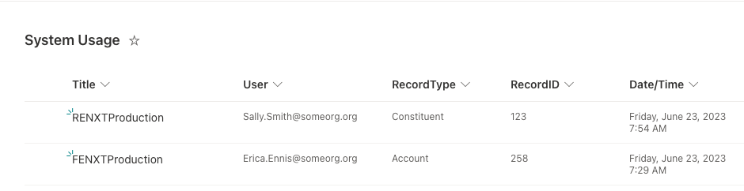
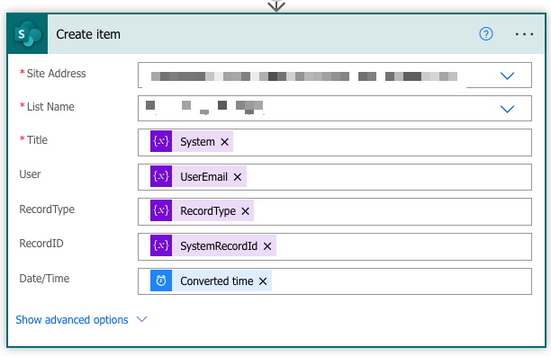
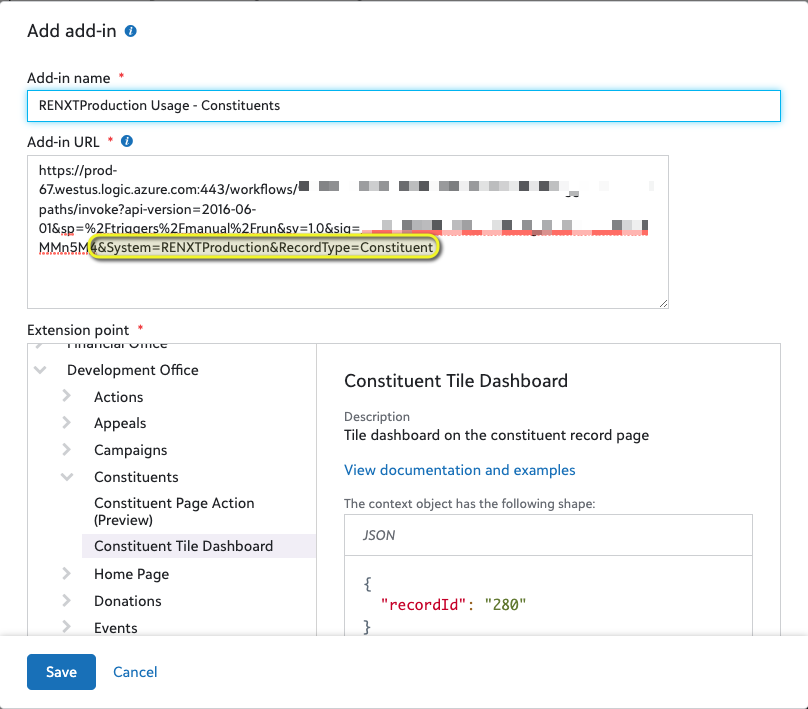

# SKY System Usage

This flow is a unique one that leverages SKY Add-in functionality, but there is no visible Tile to be seen. 

## Scenario Addressed
Organizations that wish to track the usage of the system.  This can be in relation to those new to SKY-Addin enabled solutions, especially those that have migrated from Gen7 solutions and wish to track adoption of the Web View. This works with both Raiser's Edge NXT and Financial Edge NXT. It records both the individual accessing and which records / areas a user is viewing.

### NOTE
This tracks _usage_/_viewing_ and is not an auditing solution.  This will track those that simply view different pieces of the system, but doesn't track changes.  However, it does track down to the record level.  This  means if you find that a record has been erroneously updated, you can use this to narrow down your search for suspects. 

## Method
SKY Add-ins have the ability to see which user is accessing that Add-in.  Most add-ins also automatically get the System Record ID of the record it's related to. The main exception are the "full page" Add-ins.  With these two pieces of information, you can record who is viewing which parts of the system. 

You can initialize a Tile Add-in long enough to get the above info, but yet not display the tile itself. 

### Caveats
* Since this requires Tile Add-Ins, this can only work in the parts of the system that allow them.  
* Note that most of the specialized "Host SPAs" such as the Adaptive Card assume that the tile is going to be rendered, so there's no way to stop those from showing.  For this reason, we have to use a stripped-down "All In One" version.  

## Requirements
* Though it is often mentioned that you can put many SKY Add-ins under a single SKY Developer Application, due to the way this needs to be setup, it is recommended you create a new Application for this.
* You need a place to store this information whether it be a Sharepoint List, Excel File, etc.  

## Installation
See the [Raiser's Edge NXT Readme](../README.md) for links discussing the various aspects of Tile Add-ins, "All In One" flows, disclaimer, and how to get help. 

### Pre-Setup - Sharepoint
This assumes usage of a Sharepoint list.  This is possible using another mechanism, but those setup steps may vary

Create a new Sharepoint List with the following Columns.  This is tested under the scenario that they are all Single Line text.  You may want to setup the Date/Time column as a Date format, but your end result may vary.  
* Title (the default)
* User
* RecordType
* RecordID
* Date/Time

Sharepoint Lists automatically generate IDs which may come in handy for the likes of sorting and reference.  To see the ID column:

* Navigate to the target list first
* Click the add column button
* Select the show/hide columns option
* Check the box for the ID column

### Flow-specific setup instructions
1. Convert time zone - Update the _Destination time zone_ to reflect your Org's main time zone. 
2. Due to issues that often occur when importing a flow that links to Sharepoint, and to help facilitate scenarios in which something other than Sharepoint may be used, the final step that records the data is _not_ included in the template flow.  You will need manually search for the _Sharepoint - Create item_ action or alternate one if using something other than Sharepoint. Once selected you will need to map the following fields:
   * Title - "System" Variable
   * User - "User Email" Variable
   * RecordType - "RecordType" Variable
   * RecordID - "SystemRecordId" Variable
   * Date/Time - The output of the "Converted time".

   

3. After saving the flow, copy the URL generated from the _When a HTTP request is received_ at the top of the flow. You'll need this in the next step.

### Flow-specific installation instructions
As mentioned, it is recommended that you create a separate application for this purpose as you'd need to create a _separate_ add-in for _each_ record type you want to track. 

Example Add-in for tracking those who view RENXT Constituent Records:
1. Create a New Add-in and name it "YOUR_SYSTEM_NAME Usage - Constituent"
2. For the Add-In URL, paste the URL copied from above.
3. Append to that URL `&System=YOUR_SYSTEM_NAME&RecordType=Constituents`
4. For the extension point, Select _Development Office_ -> _Constituents_ -> _Constituent Tile Dashboard_ 

"YOUR_SYSTEM_NAME" is for your internal tracking purposes only and will allow you to distinguish between RENXT/FENXT, multiple RENXTs, etc.  If you have just one system right now, it is recommended to use "RENXTProduction" / "FENXTProduction" to help future proof any additions.  

You will need repeat these steps for _each_ record type you want to track, selecting a different Extension Point (eg: _Financial Office_ -> _Ledger_ -> _Accounts_ -> _Account Tile Dashboard_) and updating the `&RecordType` in the URL accordingly (ex: `&RecordType=Accounts`)

You only need one flow for all your RENXT/FENXT instances. 

### Flow-specific considerations
1. Since this does not involve Constituent Specific information, and to allow easy deployment among multiple environments (Production vs Test, Multiple Production, etc), the typical Validation steps are not included.  **DO NOT use this or a copy of this flow to handle any constituent specific information.**

2. This has not been stress tested under high-usage scenarios.  If you have many users accessing the system and/or very active users, you may run into flow concurrency limitations, etc.  Consider slowly introducing various record types, perhaps starting with Constituents, instead of all the record types you wish to track at once.  This will allow you to monitor and see if there are any Power Automate usage throttling, etc. 
