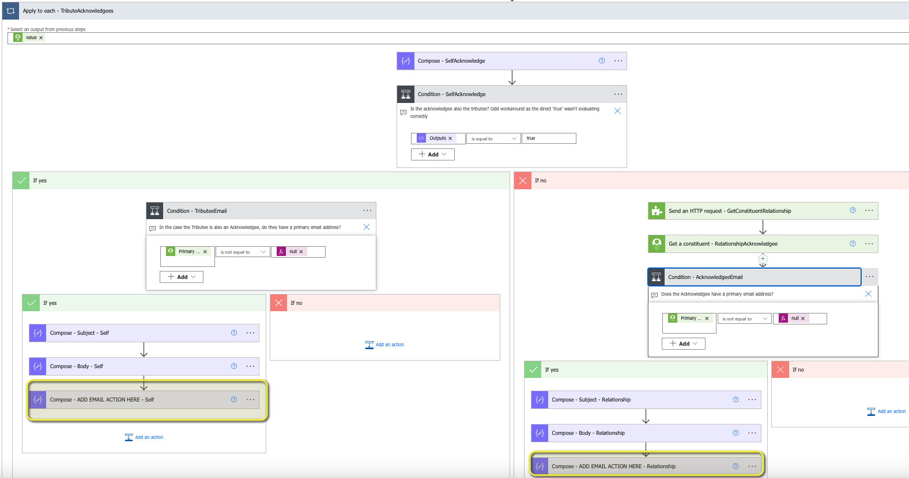
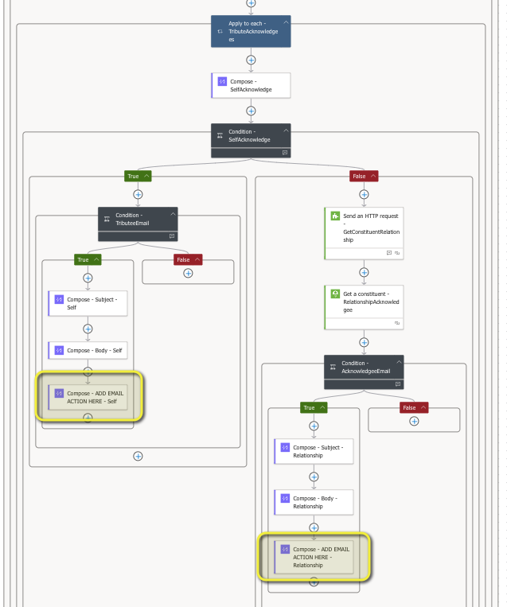

# Tribute eAcknowledgements

This flow searches for Gifts with Tributes via the Query API. It then cycles through each Gift Tribute with the end goal of sending email acknowledgements to each acknowledgee. 

_Pay specific attention to the installation instructions for full functionality_. 

## Installation
See the [Raiser's Edge NXT Readme](../README.md) for links discussing the various aspects of working with templates, specifically the links for Importing Flows. 

### Flow-specific installation instructions
1. In order to make it easier to import for various scenarios, the final email actions are _not_ included.  You **MUST** add an Outlook, Gmail, or other email action/connector. 

   * Open the _Apply to each - Gifts_ action, then the _Apply to each - GiftTributes_ action followed by _Apply to each - TributeAcknowledgees_ then _Condition - SelfAcknowledge_. 

   * Under each branch there is a _Condition - []Email_ step where one says "Tributee" and the other says "Acknowledgee".  It is at the bottom of the "Yes" of each you will need the appropriate email connections.  There are Compose Statements that have default text you can start with. 

   * Screenshots for both the Classic and New views included below. 

2. This flow is set to run 'on demand'.  Consider converting to a recurring schedule. 

3. The default setting under the _Get past time_ action is to look two days back.  Depending on decision on manual vs scheduled and when, you may need to adjust this.  

### Flow-specific considerations
1. This version does _not_ take into account soft credits which would support listing multiple donors in the acknowledgement email. 
2. This version does _not_ list fund(s) in the email acknowledgement as this will need to potentially take into account soft credits.  

Area to add email action as seen in Power Automate Classic View. 

Area to add email action as seen in Power Automate New View. 

